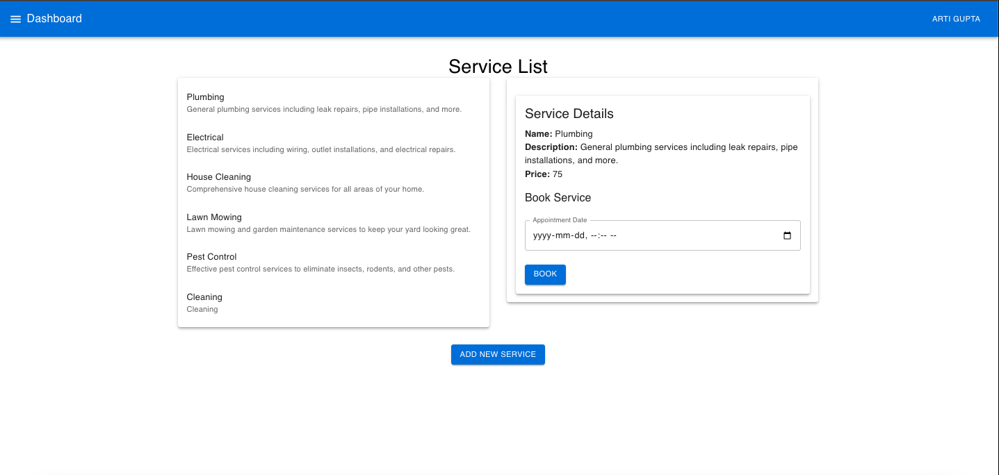

# Service Booking React App

This is a React.js application for managing services and bookings.



## Setup Instructions

1. **Clone the repository:**

    ```bash
    git clone <repository-url>
    ```

2. **Navigate to the project directory:**

    ```bash
    cd service-booking-client
    ```

3. **Install dependencies:**

    ```bash
    npm install
    ```

4. **Start the development server:**

    ```bash
    npm start
    ```

    The app will be running at [http://localhost:3000](http://localhost:3000) by default.

## Features

- View all services and book appointments.
- View and manage bookings, including deleting and modifying appointments.
- Admin dashboard to manage services, and bookings.

## Technologies Used

- **React**: Frontend library for building user interfaces.
- **Material-UI**: React component library for designing UI elements.
- **React Router**: Library for routing in React applications.
- **Axios**: Promise-based HTTP client for making API requests.
- **Context API**: For managing global state across components.

